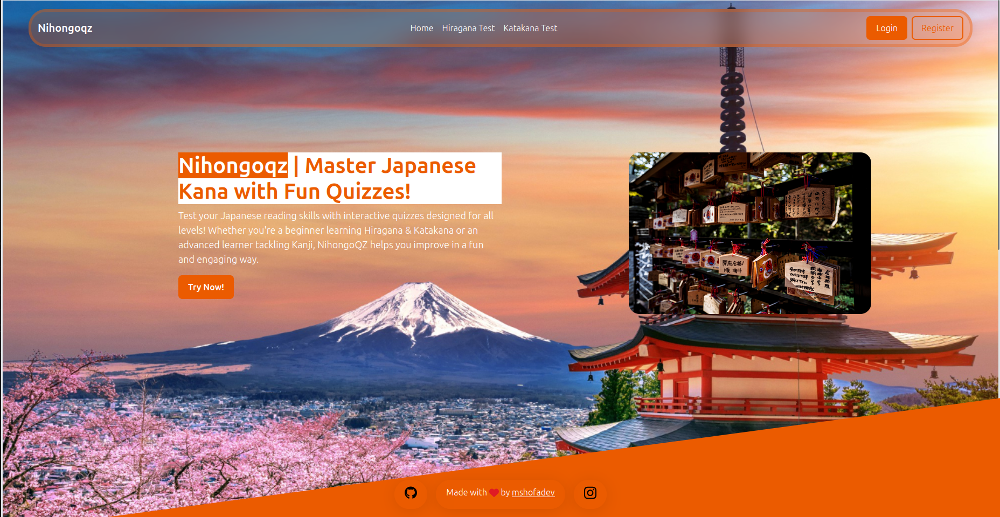
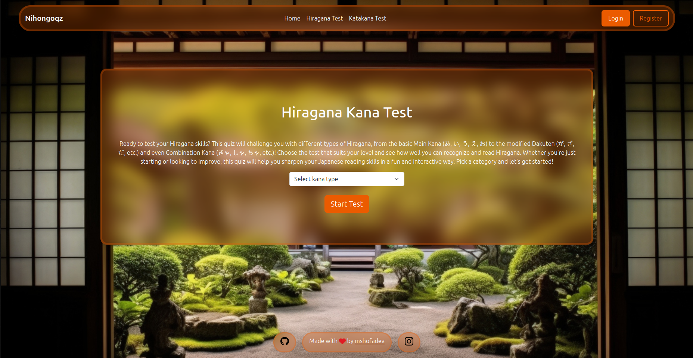
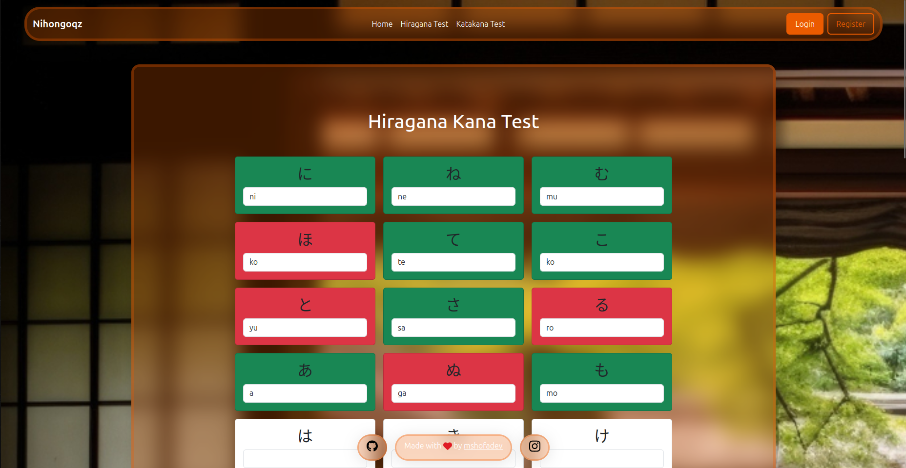
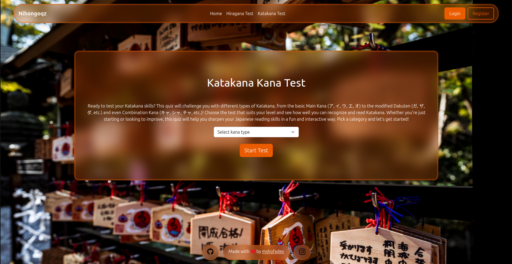
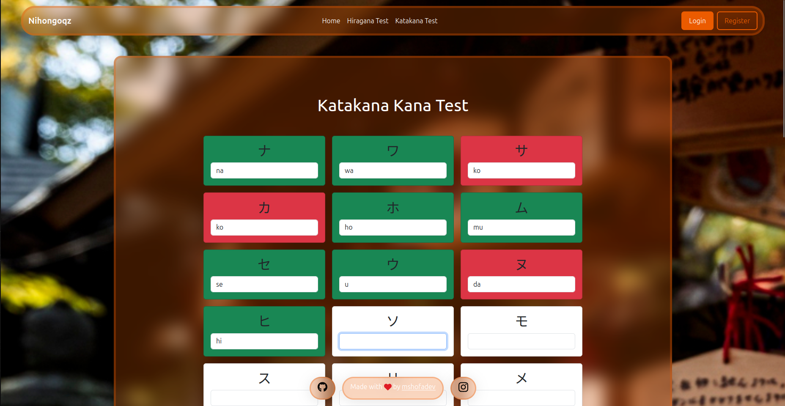
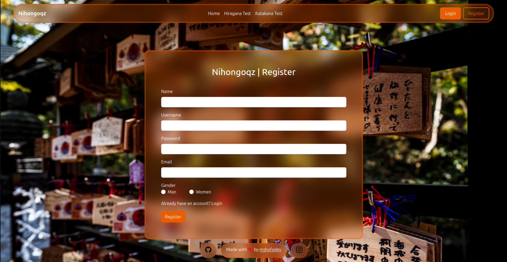
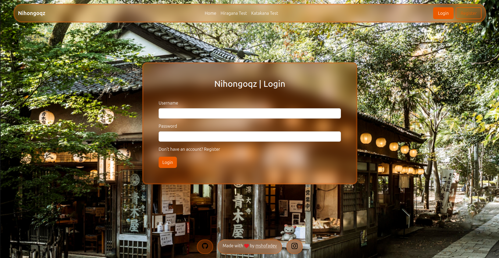
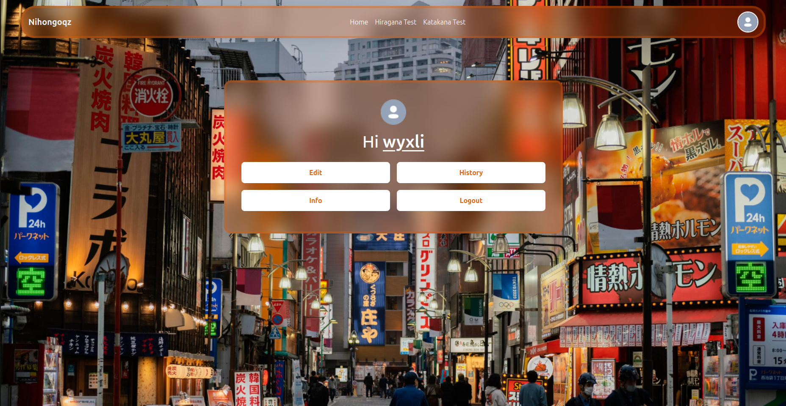
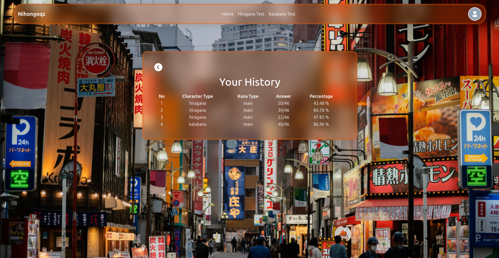

# NihongoQZ 🇯🇵✨  
**Test Your Japanese Kana Skills with Fun Quizzes!**  

  

## 📌 About NihongoQZ  
**NihongoQZ** is a web-based platform that lets you test your **Hiragana and Katakana** knowledge through interactive quizzes. Whether you're a beginner or an advanced learner, this website is designed to help you sharpen your Japanese reading skills in an engaging way.  

🚀 **Built with:**  
- CodeIgniter 4 (PHP Framework)  
- jQuery (for dynamic interactions)  
- Bootstrap + Custom CSS (for a clean UI)  

## 🎯 Features  
- Select the type of kana you want: main kana, dakuten (under development), combination (under development)
- Enter the correct romaji in each answer column
- Take the kana test without the interruption of browser reloading every time you enter an answer
- Cancel and finish the kana test at your convenience
- View your kana test results on your profile page to review how fluent you are
- The choice of taking the kana test with or without login is yours.
- Login to automatically save your kana test history

## 📷 Preview Nihongo Website
### Home Page
  

### Hiragana Prepare Test
  

### Hiragana Test Ongoing
  

### Katakana Prepare Test
  

### Katakana Test Ongoing
  

### Register
  

### Login
  

### Profile
  

### History
  

#### 💡 Nihongoqz v1.0 by mshofadev